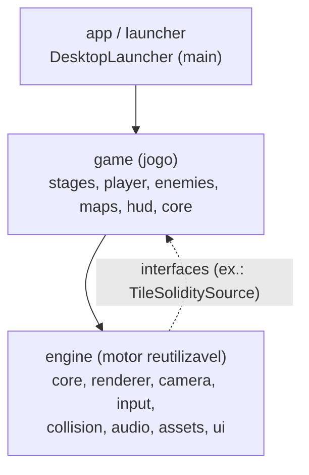
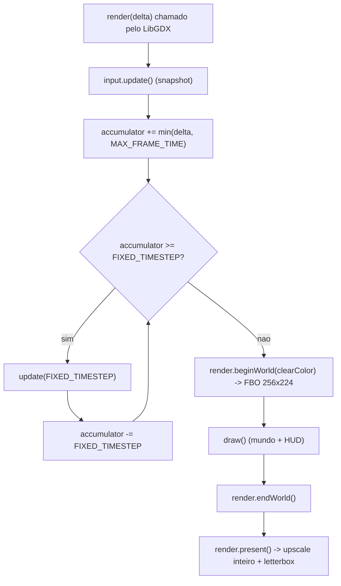
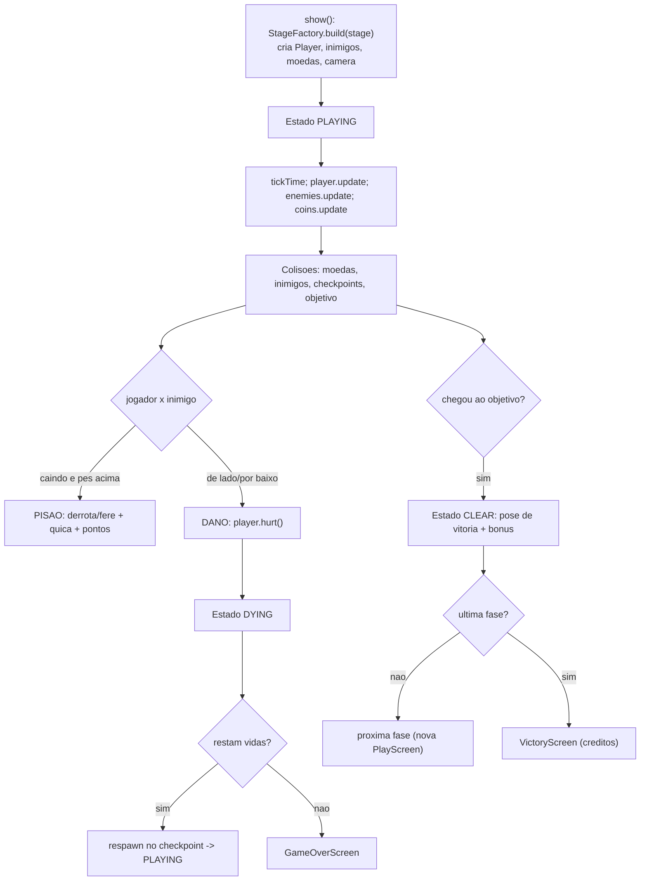
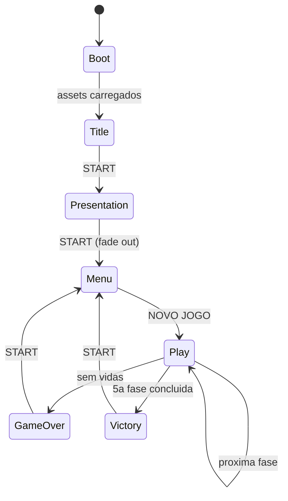

# Guia de Arquitetura

Este documento descreve **como o jogo esta organizado**, o fluxo da engine e do
gameplay, e as decisoes que mantem o codigo modular e portavel.

## Principios

1. **Separacao Engine × Game.** `engine` e um motor 2D reutilizavel; `game` e o
   jogo especifico. Regra de ouro: **`engine` nunca importa `game`**. A
   comunicacao no sentido inverso (engine precisando de dados do jogo) usa
   *interfaces* definidas no engine (ex.: `TileSoliditySource`) — inversao de
   dependencia (o "D" de SOLID).
2. **Responsabilidade unica** por pacote/classe (SRP).
3. **Passo fixo deterministico** (60 Hz) para fisica estavel.
4. **Sem dependencias circulares** — garantido pela direcao de dependencia entre
   pacotes.
5. **Composition root unico** (`DanielGame`) cria e injeta servicos.

## Camadas

- **app/launcher**: unica parte dependente de plataforma (janela LWJGL3).
- **game**: regras do jogo; conhece `engine`.
- **engine**: nao conhece o jogo; oferece servicos e contratos.

## Fluxograma da Engine (loop principal)

Todo `AbstractScreen` executa o mesmo laco com **acumulador de tempo** (fixed
timestep) e o pipeline **pixel-perfect**:

**Por que assim?** A logica roda sempre em passos de 1/60 s (deterministica,
independente do FPS de video). A renderizacao acontece uma vez por quadro no
canvas virtual e so entao e ampliada para a janela real, garantindo pixels
nitidos e proporcao correta.

## Fluxograma do Gameplay (PlayScreen)

## Fluxo de telas (state machine de alto nivel)

## Colisao (algoritmo)

- **Tile × entidade:** `TileCollisionResolver.move(box, dx, dy, world)` resolve
  **um eixo por vez** (X depois Y). Ao encontrar um tile solido, empurra a caixa
  para fora e zera a velocidade do eixo. Retorna flags (`onGround`, `hitCeiling`,
  `hitLeft`, `hitRight`). A velocidade de queda e limitada
  (`MAX_FALL_SPEED`) para evitar *tunneling*.
- **Entidade × entidade:** sobreposicao de `AABB` (teorema dos eixos separadores).

## Injecao de dependencias

`DanielGame` (composition root) cria o `GameContext` (servicos de engine) e a
`GameSession` (estado da partida) e os injeta nas telas via `BaseGameScreen`.
Nao ha singletons globais, o que facilita testes e portes.
