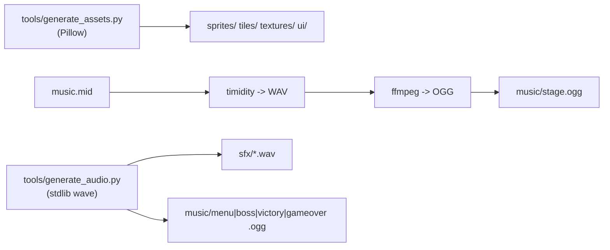

# Estrutura e Pipeline dos Assets

Todos os recursos sao **originais e gerados por ferramentas** (nenhum recurso de
terceiros). A pasta `assets/` e colocada no classpath pelo Gradle e lida em
runtime via `Gdx.files.internal(...)`.

## Organizacao

```
assets/
├── sprites/    # personagem, inimigos, moeda (spritesheets horizontais)
├── tiles/      # tileset.png (8 tiles 16x16, id 0 = transparente)
├── textures/   # bg_stage1..5.png (fundos por fase, 256x224)
├── music/      # menu/stage/boss/victory/gameover .ogg
├── sfx/        # 10 efeitos .wav
├── fonts/      # (reservado) fontes pixel-art (BMFont) - TODO
├── ui/         # elementos de interface (logo.png)
├── maps/       # (reservado) mapas externos (Tiled/JSON) - TODO
└── shaders/    # (reservado) shaders GLSL - TODO
```

## Layout dos spritesheets (deve casar com `Assets.java`)

| Arquivo | Quadros | Tamanho do quadro | Animacoes |
|---------|---------|-------------------|-----------|
| `sprites/daniel.png` | 18 | 24×32 | idle(0-1), walk(2-5), run(6-9), jump(10), fall(11), crouch(12), lookup(13), hurt(14), dead(15), victory(16-17) |
| `sprites/coin.png` | 4 | 16×16 | giro |
| `sprites/enemy_walker.png` | 4 | 16×16 | andar |
| `sprites/enemy_flyer.png` | 2 | 16×16 | voar |
| `sprites/enemy_fast.png` | 4 | 16×16 | correr |
| `sprites/enemy_tank.png` | 2 | 24×24 | andar |
| `sprites/boss.png` | 2 | 48×48 | andar |
| `tiles/tileset.png` | 8 | 16×16 | AIR, GRASS, DIRT, BRICK, PLATFORM, SPIKE, STONE, DECO |

> **Trocar por arte manual:** mantenha as **mesmas dimensoes de quadro** e o mesmo
> numero/ordem de frames; nada no codigo precisa mudar.

## Pipeline de geracao



Comandos:

```bash
python3 tools/generate_assets.py   # arte
python3 tools/generate_audio.py    # SFX + musica + conversao MIDI->OGG
```

## Estilo visual (16 bits / SNES)

- Resolucao base 256×224; tiles 16×16 reutilizaveis.
- Filtro **Nearest** em todas as texturas (pixels nitidos ao escalar).
- Paletas limitadas por sprite quando possivel.
- Cada fase tem fundo/paleta proprios (identidade visual).

## Audio

| Arquivo | Uso |
|---------|-----|
| `music/menu.ogg` | Titulo/menu |
| `music/stage.ogg` | Fases (convertido de `music.mid`) |
| `music/boss.ogg` | Fase de chefe |
| `music/victory.ogg` | Vitoria/creditos |
| `music/gameover.ogg` | Game Over |
| `sfx/*.wav` | jump, coin, hurt, defeat, break, victory, gameover, menu, select, boss |

## TODO (evolucao dos assets)

- Fonte pixel-art dedicada (BMFont) em `fonts/` (hoje usa a fonte embutida do
  LibGDX escalada).
- Sistema de particulas + shaders (pastas ja reservadas).
- Carregamento de mapas externos (Tiled) em `maps/`.
