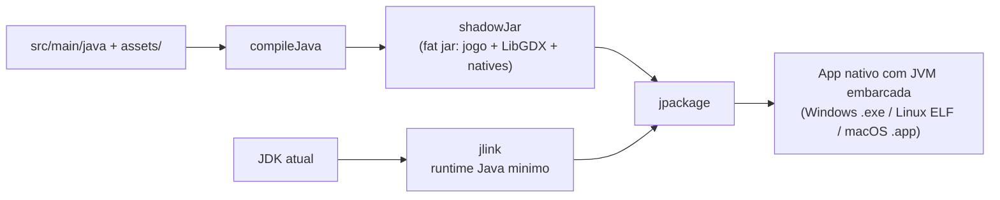

# Manual de Compilacao e Pipeline de Build

## Requisitos

- **JDK 17+** (recomendado Eclipse Temurin 21/25). O `build.gradle` fixa a
  *toolchain* em 17; troque `JavaLanguageVersion.of(17)` para atualizar.
- **Gradle wrapper** incluso — use `./gradlew` (nao precisa instalar Gradle).
- Internet na primeira compilacao (baixa LibGDX e o plugin Shadow do Maven Central).
- Para regerar assets/audio: Python 3 + Pillow, `ffmpeg`, `timidity`.

## Tarefas principais

| Comando | O que faz |
|---------|-----------|
| `./gradlew run` | Compila e executa o jogo (janela desktop). |
| `./gradlew test` | Roda os testes de logica pura (colisao, fisica, fases, sessao). |
| `./gradlew shadowJar` | Gera o *fat jar* (`build/libs/DanielDoBolosAdventure-<versao>.jar`). |
| `./gradlew runtime` | Gera o runtime Java minimo com `jlink`. |
| `./gradlew packageApp` | Gera o **aplicativo nativo** com JVM embarcada (`jpackage --type app-image`). |
| `./gradlew installer` | Gera o **instalador nativo** do SO atual (msi/deb/dmg). |

## Pipeline de build (empacotamento)



### Por que este fluxo (e nao um plugin modular)?

O LibGDX ainda **nao e totalmente modular (JPMS)**, o que torna `module-info`
trabalhoso. O fluxo *fat jar + jlink (runtime universal) + jpackage* e robusto,
nao exige modularizar o classpath e produz um app com a JVM embarcada.

## Saidas por plataforma

`jpackage`/`jlink` **so geram artefatos para o SO em que rodam** (nao ha
cross-build). Execute o build em cada SO alvo:

| SO | `packageApp` (app-image) | `installer` |
|----|--------------------------|-------------|
| Windows | pasta com `Daniel do Bolo's Adventure.exe` | `.msi` |
| Linux | binario `DanielDoBolosAdventure` (ELF) | `.deb` |
| macOS | `Daniel do Bolo's Adventure.app` | `.dmg` |

### Onde ficam os artefatos

Por padrao em `~/DanielDoBolosAdventure-build/` (`dist/` e `installer/`).

> **Motivo:** `jlink` cria *hard links* nos arquivos de licenca do runtime, o que
> **falha em NTFS/exFAT** (particoes Windows/HDs externos montados no Linux).
> Colocando a saida no `HOME` (tipicamente ext4/APFS/NTFS nativo do Windows) o
> empacotamento funciona mesmo com o codigo-fonte num drive NTFS/exFAT.
>
> Para escolher outro destino:
> ```bash
> ./gradlew packageApp -PdistDir=/caminho/de/saida
> ```

## Versionamento

A versao vem de `gradle.properties` (`appVersion`), usada no nome do jar e no
`--app-version` do `jpackage`.

## Modulos do runtime (jlink)

O runtime inclui: `java.base, java.desktop, java.logging, jdk.unsupported,
java.management` — suficientes para LibGDX/LWJGL3. Se um porte usar mais APIs,
adicione o modulo em `--add-modules` na tarefa `runtime` do `build.gradle`.
