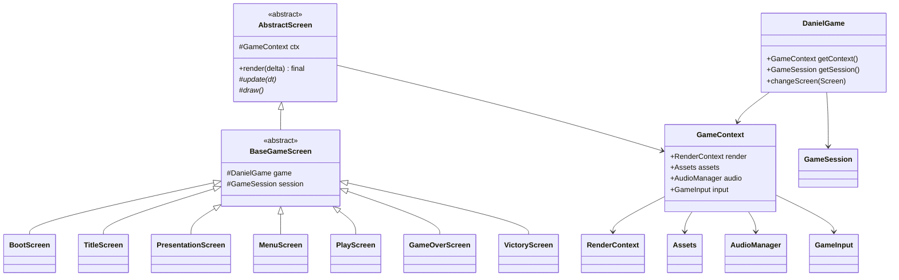
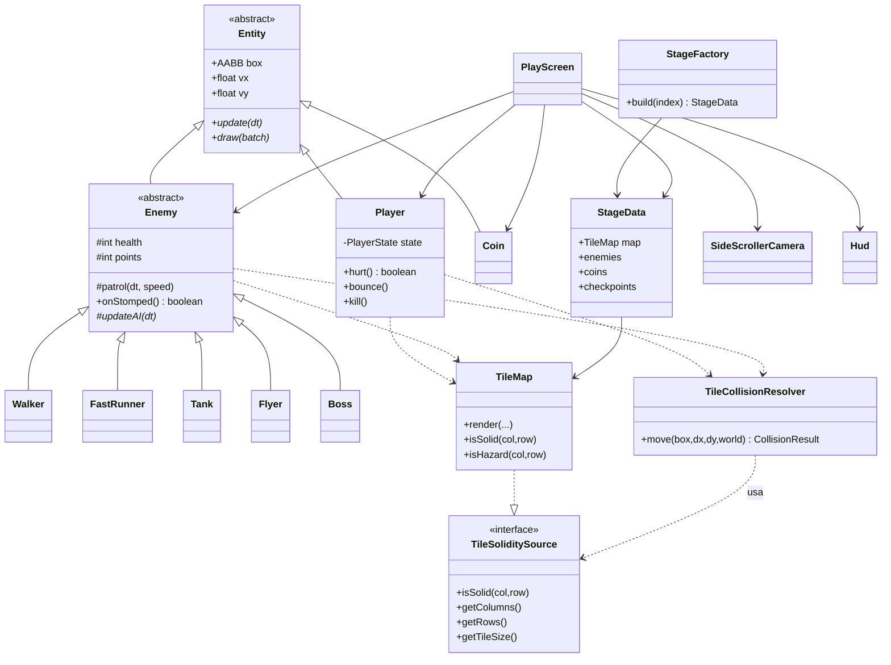

# Diagrama de Classes

Visao das principais classes e relacoes (Mermaid). Simplificado para clareza.

## Engine + fluxo de telas

```mermaid
classDiagram
    class GameContext {
      +RenderContext render
      +Assets assets
      +AudioManager audio
      +GameInput input
    }
    class AbstractScreen {
      <<abstract>>
      #GameContext ctx
      +render(delta) final
      #update(dt)*
      #draw()*
    }
    class DanielGame {
      +GameContext getContext()
      +GameSession getSession()
      +changeScreen(Screen)
    }
    class BaseGameScreen {
      <<abstract>>
      #DanielGame game
      #GameSession session
    }

    AbstractScreen <|-- BaseGameScreen
    BaseGameScreen <|-- BootScreen
    BaseGameScreen <|-- TitleScreen
    BaseGameScreen <|-- PresentationScreen
    BaseGameScreen <|-- MenuScreen
    BaseGameScreen <|-- PlayScreen
    BaseGameScreen <|-- GameOverScreen
    BaseGameScreen <|-- VictoryScreen

    DanielGame --> GameContext
    DanielGame --> GameSession
    AbstractScreen --> GameContext
    GameContext --> RenderContext
    GameContext --> Assets
    GameContext --> AudioManager
    GameContext --> GameInput
```

## Entidades e mundo

```mermaid
classDiagram
    class Entity {
      <<abstract>>
      +AABB box
      +float vx
      +float vy
      +update(dt)*
      +draw(batch)*
    }
    class Player {
      -PlayerState state
      +hurt() boolean
      +bounce()
      +kill()
    }
    class Enemy {
      <<abstract>>
      #int health
      #int points
      #patrol(dt, speed)
      +onStomped() boolean
      #updateAI(dt)*
    }
    class Coin

    Entity <|-- Player
    Entity <|-- Enemy
    Entity <|-- Coin
    Enemy <|-- Walker
    Enemy <|-- FastRunner
    Enemy <|-- Tank
    Enemy <|-- Flyer
    Enemy <|-- Boss

    class TileMap {
      +render(...)
      +isSolid(col,row)
      +isHazard(col,row)
    }
    class TileSoliditySource {
      <<interface>>
      +isSolid(col,row)
      +getColumns()
      +getRows()
      +getTileSize()
    }
    class TileCollisionResolver {
      +move(box,dx,dy,world) CollisionResult
    }

    TileMap ..|> TileSoliditySource
    TileCollisionResolver ..> TileSoliditySource : usa
    Player ..> TileCollisionResolver
    Enemy ..> TileCollisionResolver
    Player ..> TileMap
    Enemy ..> TileMap

    class StageFactory {
      +build(index) StageData
    }
    class StageData {
      +TileMap map
      +enemies
      +coins
      +checkpoints
    }
    StageFactory --> StageData
    StageData --> TileMap
    PlayScreen --> StageData
    PlayScreen --> Player
    PlayScreen --> Enemy
    PlayScreen --> Coin
    PlayScreen --> SideScrollerCamera
    PlayScreen --> Hud
```
