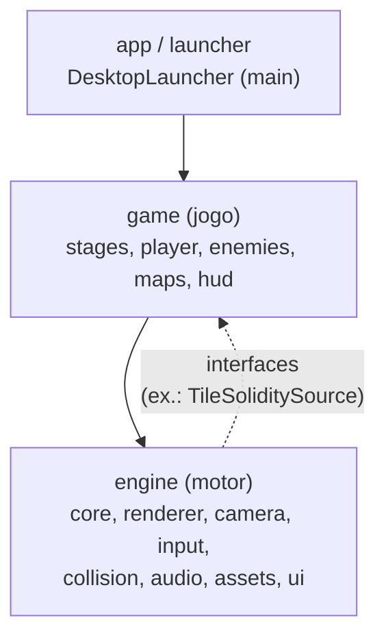
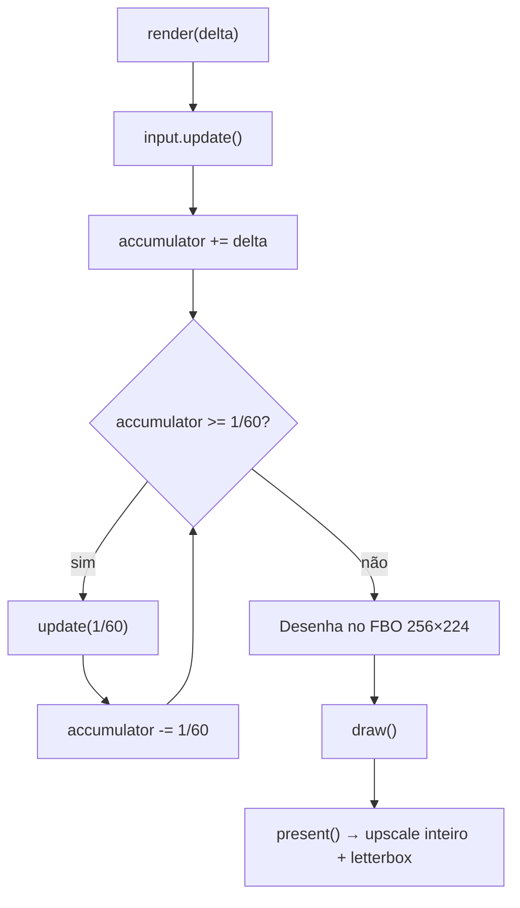
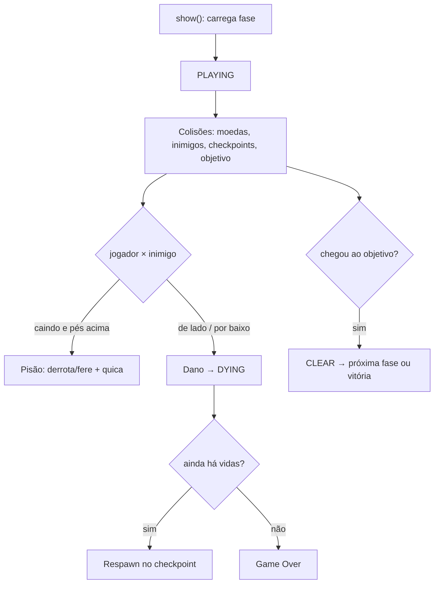
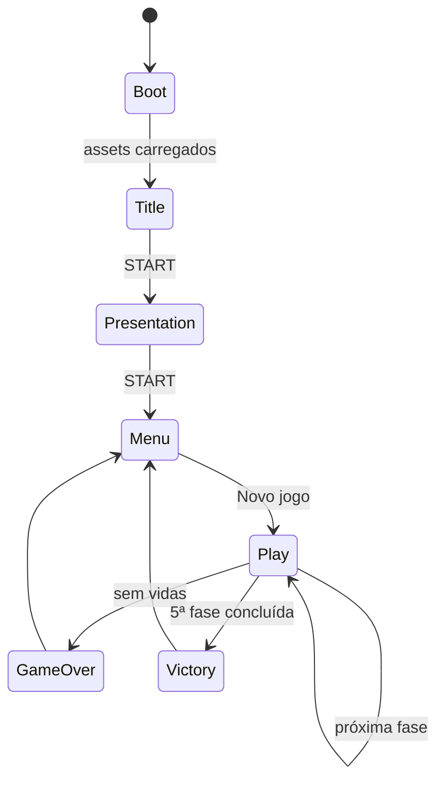

# 03 — Guia da Arquitetura

## Princípios

1. **Separação Engine × Game.** O pacote `engine` é o motor 2D reutilizável; o
   pacote `game` contém a jogabilidade. Regra de ouro: **`engine` nunca importa
   `game`**.
2. **Responsabilidade única** por pacote e classe (SRP).
3. **Passo fixo determinístico (60 Hz)** para física estável.
4. **Sem dependências circulares.**
5. **Composition root único** (`DanielGame`) cria e injeta os serviços.

## Camadas

| Camada | Papel |
|--------|-------|
| `app` | Única parte dependente de plataforma (janela LWJGL3) |
| `game` | Regras do jogo; usa o `engine` |
| `engine` | Serviços reutilizáveis; não conhece o jogo |

Quando o motor precisa de dados do jogo (ex.: “este tile é sólido?”), usa uma
**interface** definida no engine (`TileSoliditySource`). O jogo implementa o
contrato — isso é **inversão de dependência** (o “D” de SOLID).

## Fluxograma da Engine

Todo `AbstractScreen` executa o mesmo laço:

**Por quê?** A lógica roda sempre a 60 passos por segundo (como um console NTSC).
A renderização ocorre uma vez por quadro no canvas virtual e depois é ampliada
para a janela real, mantendo pixels nítidos.

## Fluxograma do Gameplay

## Fluxo de telas

## Colisão

- **Tiles:** `TileCollisionResolver` move a caixa um eixo por vez (X depois Y).
  Ao bater em tile sólido, encosta a caixa e zera a velocidade daquele eixo.
- **Entidades:** sobreposição de `AABB` (caixas alinhadas aos eixos).
- A velocidade de queda é limitada (`MAX_FALL_SPEED`) para evitar *tunneling*.

## Decisões importantes

| Decisão | Motivo |
|---------|--------|
| Módulo Gradle único + pacotes bem separados | Build simples; evita dependências circulares |
| Fixed timestep | Física determinística |
| Canvas 256×224 + upscale inteiro | Visual fiel ao SNES em monitores modernos |
| Sem singletons | Facilita testes e portes |
