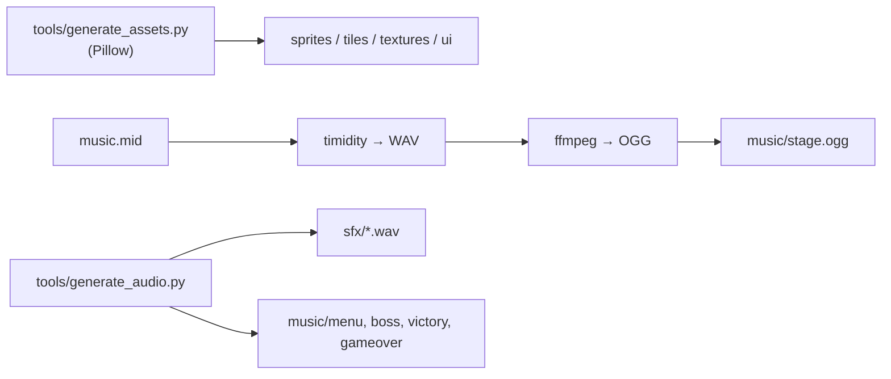

# 08 — Estrutura dos Assets

Todos os recursos são **originais** e gerados pelas ferramentas do projeto
(`tools/`). Não há sprites, sons ou músicas protegidos por direitos autorais de
terceiros.

## Organização

```
assets/
├── sprites/     # Personagem, inimigos, moeda (spritesheets horizontais)
├── tiles/       # tileset.png (8 tiles 16×16; id 0 = transparente)
├── textures/    # bg_stage1..5.png (fundos por fase, 256×224)
├── music/       # menu / stage / boss / victory / gameover (.ogg)
├── sfx/         # 10 efeitos (.wav)
├── fonts/       # Reservado — fonte pixel-art (BMFont) — TODO
├── ui/          # Elementos de interface (logo.png)
├── maps/        # Reservado — mapas externos (Tiled/JSON) — TODO
└── shaders/     # Reservado — shaders GLSL — TODO
```

## Layout dos spritesheets

Deve casar com `Assets.java`:

| Arquivo | Quadros | Tamanho | Animações |
|---------|---------|---------|-----------|
| `sprites/daniel.png` | 18 | 24×32 | idle (0–1), walk (2–5), run (6–9), jump (10), fall (11), crouch (12), look-up (13), hurt (14), dead (15), victory (16–17) |
| `sprites/coin.png` | 4 | 16×16 | giro |
| `sprites/enemy_walker.png` | 4 | 16×16 | andar |
| `sprites/enemy_flyer.png` | 2 | 16×16 | voar |
| `sprites/enemy_fast.png` | 4 | 16×16 | correr |
| `sprites/enemy_tank.png` | 2 | 24×24 | andar |
| `sprites/boss.png` | 2 | 48×48 | andar |
| `tiles/tileset.png` | 8 | 16×16 | AIR, GRASS, DIRT, BRICK, PLATFORM, SPIKE, STONE, DECO |

> **Trocar por arte manual:** mantenha as **mesmas dimensões de quadro** e a
> mesma ordem de frames. O código não precisa mudar.

## Pipeline de geração



```bash
python3 tools/generate_assets.py
python3 tools/generate_audio.py
```

## Estilo visual (16 bits / SNES)

- Resolução base **256×224**
- Tiles **16×16** reutilizáveis
- Filtro **Nearest** (pixels nítidos ao escalar)
- Paletas limitadas por sprite quando possível
- Cada fase tem fundo e identity visual próprios

## Áudio

| Arquivo | Uso |
|---------|-----|
| `music/menu.ogg` | Título / menu (convertido de `menu_lady.mid`) |
| `music/stage.ogg` | Fases (convertido de `music.mid`) |
| `music/boss.ogg` | Fase de chefe (convertido de `boss.mid`) |
| `music/victory.ogg` | Vitória / créditos |
| `music/gameover.ogg` | Game Over |
| `sfx/jump.wav` | Pulo |
| `sfx/coin.wav` | Moeda |
| `sfx/hurt.wav` | Dano |
| `sfx/defeat.wav` | Derrota de inimigo |
| `sfx/break.wav` | Quebra |
| `sfx/victory.wav` | Vitória |
| `sfx/gameover.wav` | Game Over |
| `sfx/menu.wav` | Navegação de menu |
| `sfx/select.wav` | Seleção / confirmação |
| `sfx/boss.wav` | Chefe |

## Evolução futura (TODOs)

- Fonte pixel-art dedicada (BMFont) em `fonts/`
- Sistema de partículas e shaders (pastas já reservadas)
- Carregamento de mapas externos (Tiled) em `maps/`
