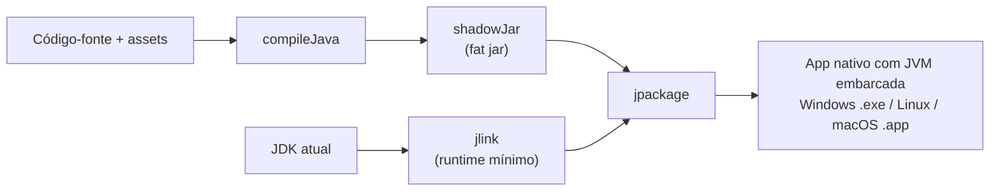

# 09 — Pipeline de Build

## Visão geral

O build usa **Gradle** com:

1. **Compilação Java** (toolchain 17+)
2. **shadowJar** — fat jar com o jogo + LibGDX + natives
3. **jlink** — runtime Java mínimo personalizado
4. **jpackage** — aplicativo/instalador nativo com a JVM embarcada



## Por que este fluxo?

O LibGDX ainda **não é totalmente modular (JPMS)**. O caminho
*fat jar + jlink (runtime universal) + jpackage* é robusto, não exige modularizar
o classpath e entrega um app com a JVM embutida — o usuário **não** precisa
instalar Java.

## Tarefas Gradle

| Comando | Função |
|---------|--------|
| `./gradlew run` | Compila e executa o jogo |
| `./gradlew test` | Testes de lógica pura |
| `./gradlew shadowJar` | Fat jar em `build/libs/` |
| `./gradlew runtime` | Runtime `jlink` |
| `./gradlew packageApp` | App nativo (app-image) |
| `./gradlew installer` | Instalador nativo do SO atual |

## Saídas por plataforma

`jpackage` / `jlink` só geram artefatos para o **SO hospedeiro**:

| SO | `packageApp` | `installer` |
|----|--------------|-------------|
| Windows | pasta com `.exe` | `.msi` |
| Linux | binário ELF | `.deb` |
| macOS | `.app` | `.dmg` |

## Destino padrão dos artefatos

```
~/DanielDoBolosAdventure-build/
├── staging/     # fat jar isolado para o jpackage
├── runtime/     # runtime jlink
├── dist/        # app-image
└── installer/   # instalador
```

O destino fica no `HOME` porque o `jlink` cria *hard links* e **falha em
NTFS/exFAT**. Override:

```bash
./gradlew packageApp -PdistDir=/caminho/desejado
```

## Módulos do runtime (jlink)

```
java.base
java.desktop
java.logging
jdk.unsupported
java.management
```

Suficientes para LibGDX / LWJGL3. Se um futuro porte usar mais APIs do JDK,
adicione o módulo em `--add-modules` na tarefa `runtime` do `build.gradle`.

## Versionamento

A versão vem de `gradle.properties` (`appVersion`) e é usada no nome do jar e no
`--app-version` do `jpackage`.

## Checklist de entrega

- [ ] `./gradlew build` sem erros
- [ ] `./gradlew test` passando
- [ ] `./gradlew packageApp` gerando o app com JVM embarcada
- [ ] (Opcional) `./gradlew installer` no SO alvo
- [ ] Documentação atualizada em `docs/pt-BR/`
